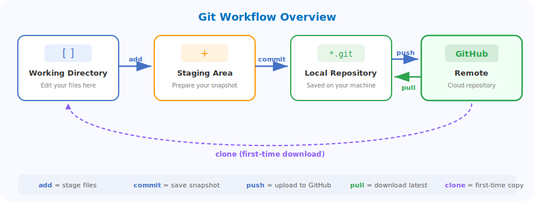

# A Beginner's Guide to GitHub: From Zero to Hero

Welcome! This guide walks you through the essentials of **Git** and **GitHub** — from understanding the concepts to actually using them in your workflow.

---

## 1. Git vs. GitHub

| | Git | GitHub |
|:---|:---|:---|
| **What** | A version control *system* | A cloud-based *hosting service* |
| **Where** | Runs locally on your computer | Runs on the web ([github.com](https://github.com)) |
| **Purpose** | Tracks every change to your files | Stores, shares, and enables collaboration on Git repositories |

> **Analogy:** Git is like a journal that records every edit you make. GitHub is the library where you publish and share that journal.

---

## 2. Key Terminology

- **Repository (Repo):** A project folder containing all your files and their version history.
- **Commit:** A "snapshot" of your changes — like a save point in a video game.
- **Branch:** A parallel version of your repo for experimenting without affecting the main code.
- **Remote:** The version of your project hosted on GitHub.
- **Clone:** Copying a repository from GitHub to your local computer.

---

## 3. The Git Workflow

The diagram below shows how files flow through Git:



### The "Big Three" Commands

**1. Stage your changes** — tell Git which files to include in the next snapshot:

```bash
git add .
```

**2. Record the snapshot** — save changes with a descriptive message:

```bash
git commit -m "Add a new feature to the homepage"
```

**3. Send to GitHub** — upload your local commits:

```bash
git push origin main
```

---

## 4. Getting Started

### Create a GitHub Account

Go to [github.com](https://github.com) and sign up.

### Install Git

- **Windows:** Download [Git for Windows](https://gitforwindows.org/)
- **Mac:** `brew install git` or download from [git-scm.com](https://git-scm.com/)
- **Linux:** `sudo apt install git-all`

### Configure Git

```bash
git config --global user.name "Your Name"
git config --global user.email "your-email@example.com"
```

---

## 5. Your First Repository

1. Click **+** → **New repository** on GitHub
2. Name it (e.g. `my-first-project`), check "Add a README file", and click **Create repository**
3. Clone it to your machine:

```bash
git clone https://github.com/your-username/my-first-project.git
cd my-first-project
```

Now you're ready to edit, commit, and push!

---

## 6. Branching and Merging

Branches let you experiment safely:

```bash
git checkout -b feature-improvement   # Create & switch to new branch
# ... make changes and commit ...
git checkout main                     # Switch back to main
git merge feature-improvement         # Merge your changes
```

---

## 7. Collaboration: Pull Requests

When working with a team, use **Pull Requests** instead of merging directly:

1. Push your branch: `git push origin feature-improvement`
2. On GitHub, click **Compare & pull request**
3. Describe your changes → **Create pull request**
4. After review → **Merge pull request**

---

## 8. Command Cheat Sheet

| Command | Purpose |
|:---|:---|
| `git status` | See which files are changed or staged |
| `git log` | View the history of all commits |
| `git pull` | Download the latest changes from GitHub |
| `git remote -v` | See which remote your local repo is linked to |
| `git diff` | Show exactly what lines changed |

---

## 9. Best Practices

- **Commit often** — small, frequent commits are easier to manage
- **Write good messages** — "Fix login button styling on mobile" > "Fixed stuff"
- **Pull before you push** — always get the latest version first
- **Don't upload secrets** — use `.gitignore` for passwords, API keys, `.env` files

---

*The best way to learn Git is by doing. Start a project, make some mistakes, and keep pushing!*
