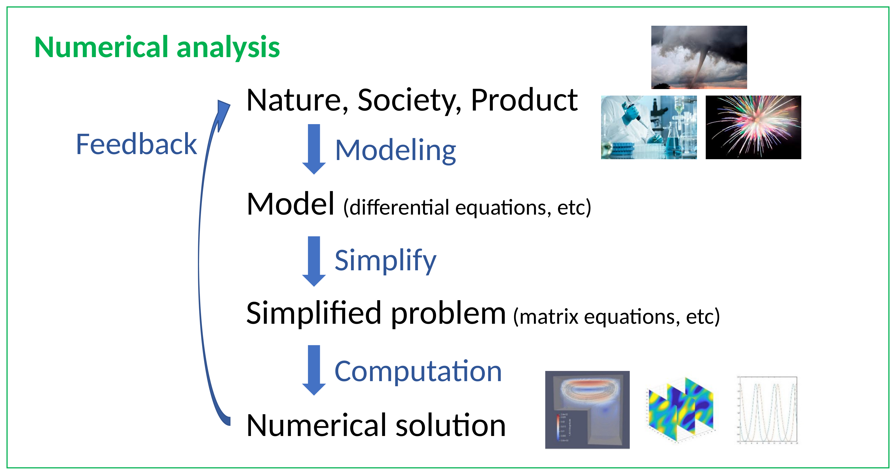
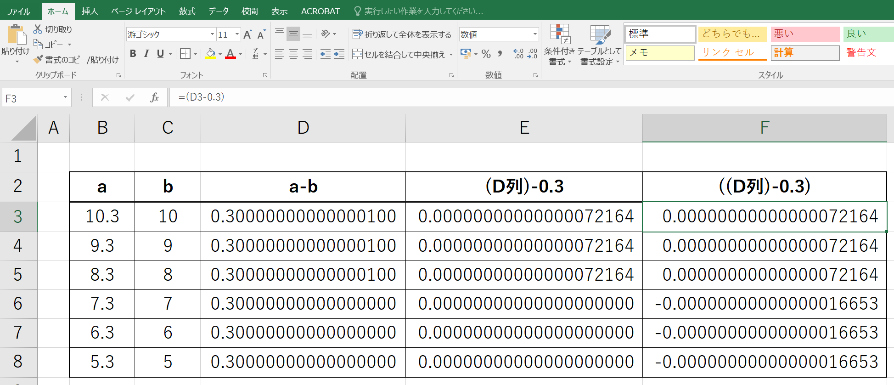

## Before We Start {.smaller}

```{=html}
<div class="mission-tip" style="margin-top:0.6em; margin-bottom:0.8em;">
  <div class="mission-tip-icon">📥</div>
  <div class="mission-tip-content">
    <strong>Please clone (or pull) the course materials repository right now.</strong>
  </div>
</div>

<div style="display:flex; flex-direction:column; gap:0.5em; margin-bottom:0.8em;">
  <div>
    <div style="font-size:0.78em; color:#888; margin-bottom:0.2em;">First time</div>
    <pre style="margin:0; background:#1e1e2e; color:#cdd6f4; border-radius:8px; padding:0.5em 1em; font-size:0.78em; line-height:1.5;"><code>git clone https://github.com/waseda-num-analysis-2026/materials</code></pre>
  </div>
  <div>
    <div style="font-size:0.78em; color:#888; margin-bottom:0.2em;">Already cloned</div>
    <pre style="margin:0; background:#1e1e2e; color:#cdd6f4; border-radius:8px; padding:0.5em 1em; font-size:0.78em; line-height:1.5;"><code>cd materials
git pull</code></pre>
  </div>
</div>
<p style="font-size:0.78em; color:#666; margin:0.3em 0 0.6em 0.2em;">💡 Not sure how? Just ask your AI — it can run these commands for you.</p>

<div style="background:#f0f4ff; border-left:3px solid #4472C4; border-radius:6px; padding:0.6em 1em; font-size:0.82em;">
  <strong>Today's materials</strong> are inside <code>020/2nd/</code>:
  <table style="margin-top:0.4em; border-collapse:collapse; width:100%;">
    <tr><td style="padding:0.15em 0.6em 0.15em 0;"><code>2nd.qmd</code></td><td style="color:#555;">slides (this file)</td></tr>
    <tr><td style="padding:0.15em 0.6em 0.15em 0;"><code>2nd.html</code></td><td style="color:#555;">rendered slides — viewable in browser</td></tr>
    <tr><td style="padding:0.15em 0.6em 0.15em 0;"><code>2nd-handout.qmd</code></td><td style="color:#555;">editable handout — customise it!</td></tr>
    <tr><td style="padding:0.15em 0.6em 0.15em 0;"><code>2nd-handout.html</code></td><td style="color:#555;">rendered handout — viewable in browser</td></tr>
  </table>
  Also in <code>020/python_guidelines/</code>: Python Guidelines document &amp; notebook.
</div>
```

## ⚠️ GitHub Copilot Student — Important Update {.smaller}

```{=html}
<div class="attention-hero" style="margin-bottom:0.6em;">
  <div class="attention-icon">📰</div>
  <div class="attention-content" style="font-size:0.92em;">
    <strong>As of April 20, 2026, new sign-ups for GitHub Copilot Student are <span style="color:#d84315;">temporarily paused.</span></strong><br>
    <span style="font-size:0.85em;">Source: <a href="https://github.blog/changelog/2026-04-20-changes-to-github-copilot-plans-for-individuals/" target="_blank">GitHub Changelog — Apr 20, 2026</a></span>
  </div>
</div>
```

```{=html}
<div style="display:flex; flex-direction:column; gap:0.6em; margin-top:0.4em;">
  <div class="tool-card">
    <div class="tool-icon">✅</div>
    <div class="tool-content">
      <div class="tool-title" style="font-size:0.9em;">Already verified?</div>
      <div class="tool-desc">You keep Copilot Student access as-is</div>
    </div>
  </div>
  <div class="tool-card">
    <div class="tool-icon">⚠️</div>
    <div class="tool-content">
      <div class="tool-title" style="font-size:0.9em;">Pending / not yet verified?</div>
      <div class="tool-desc">New sign-up temporarily blocked — check <a href="https://github.com/settings/copilot">github.com/settings/copilot</a></div>
    </div>
  </div>
</div>
```

## If Copilot Is Not Available — Alternatives {.smaller}

```{=html}
<div style="display:grid; grid-template-columns:1fr 1fr; gap:0.6em; margin-top:0.3em; font-size:0.82em;">

  <!-- LEFT: Editor-based -->
  <div>
    <div style="font-size:0.78em; font-weight:600; color:#4472C4; margin-bottom:0.3em;">💻 Editor-based</div>
    <div class="tool-card" style="margin-bottom:0.4em;">
      <div class="tool-content">
        <div class="tool-title" style="font-size:0.85em;">GitHub Copilot Free <span style="font-size:0.8em; color:#888;">VS Code extension</span></div>
        <div class="tool-desc">50 premium requests/month — <a href="https://github.com/settings/copilot">github.com/settings/copilot</a></div>
      </div>
    </div>
    <div class="tool-card" style="margin-bottom:0.4em;">
      <div class="tool-content">
        <div class="tool-title" style="font-size:0.85em;">Cursor / Antigravity <span style="font-size:0.8em; color:#888;">standalone editors</span></div>
        <div class="tool-desc">AI-first editors (not VS Code extensions — separate apps). Free quota limited. <a href="https://cursor.com">cursor.com</a> / <a href="https://antigravity.dev">antigravity.dev</a></div>
      </div>
    </div>
    <div class="tool-card tool-card-ai">
      <div class="tool-content">
        <div class="tool-title" style="font-size:0.85em;">ChatGPT paid → <strong>Codex</strong> extension ⭐</div>
        <div class="tool-desc">If you have ChatGPT Plus/Pro, install the <strong>Codex</strong> VS Code extension — chat &amp; edit code directly inside VS Code.</div>
      </div>
    </div>
  </div>

  <!-- RIGHT: Chat-based -->
  <div>
    <div style="font-size:0.78em; font-weight:600; color:#4472C4; margin-bottom:0.3em;">💬 Chat-based (browser)</div>
    <div class="tool-card tool-card-ai" style="margin-bottom:0.4em;">
      <div class="tool-content">
        <div class="tool-title" style="font-size:0.85em;">Gemini / ChatGPT / Claude</div>
        <div class="tool-desc">Paste <code>2nd-handout.qmd</code> into a thread → ask questions in the <strong>same thread</strong>.<br>
        <span style="color:#555;">I personally find Gemini handy — but it depends on the task.</span></div>
      </div>
    </div>
    <div style="background:#fff8e1; border-left:3px solid #f59e0b; border-radius:6px; padding:0.4em 0.7em; font-size:0.78em; color:#555; margin-bottom:0.4em;">
      ✨ <strong>Have a paid plan?</strong> Use it — Gemini Advanced, ChatGPT Plus/Pro, or Claude Pro give much better results.
    </div>
    <div style="background:#f0f4ff; border-left:3px solid #4472C4; border-radius:6px; padding:0.4em 0.7em; font-size:0.78em; color:#555;">
      💡 <strong>Free quotas run out?</strong> Sign up for all three (Gemini, ChatGPT, Claude) and rotate between them. For Gemini, multiple Google accounts work fine too.
    </div>
  </div>

</div>
```

## What is Numerical Analysis? {.smaller}

```{=html}
<div class="na-hero">
  <div class="na-hero-symbols">
    <span class="glyph-int">∫</span>
    <span class="glyph-sigma">Σ</span>
    <span class="glyph-partial">∂</span>
  </div>
  <div class="na-hero-tagline">
    <div class="na-hero-main-title">A Branch of Mathematics</div>
    Algorithms for solving mathematical problems<br>that <strong>cannot be solved analytically</strong>
  </div>
</div>

<div class="na-cards">
  <div class="na-card">
    <div class="na-card-icon">🏛️</div>
    <div class="na-card-title">Deep Historical Roots</div>
    <div class="na-card-desc">Dating back to <strong>1800 BCE</strong>, with significant contributions from renowned mathematicians throughout history</div>
  </div>
  <div class="na-card">
    <div class="na-card-icon">🌍</div>
    <div class="na-card-title">Wide Applications</div>
    <div class="na-card-desc">Across <strong>natural sciences</strong>, <strong>engineering</strong>, and even humanities &amp; social sciences</div>
  </div>
  <div class="na-card">
    <div class="na-card-icon">💻</div>
    <div class="na-card-title">Computer-Driven</div>
    <div class="na-card-desc">Modern numerical analysis relies on <strong>computer technology</strong> for practical computation</div>
  </div>
</div>
```

## Process of Numerical Analysis {.smaller}

{fig-align="center"}

## A Very Simple Application {.smaller}

::: {.app-question}
**What is the radius of the circle whose area is $2$ ?**
:::

```{=html}
<div class="app-grid">
  <div class="app-circle">
    <svg viewBox="0 0 200 200" width="200" height="200">
      <circle cx="100" cy="100" r="85" fill="#cfe2ff" stroke="#4472C4" stroke-width="2"/>
      <line x1="100" y1="100" x2="160" y2="55" stroke="#4472C4" stroke-width="1.5"/>
      <circle cx="100" cy="100" r="3" fill="#4472C4"/>
      <text x="118" y="80" font-family="Cambria Math, serif" font-style="italic" font-size="20" fill="#0070C0">r</text>
      <text x="92" y="160" font-family="Cambria Math, serif" font-size="22" fill="#0070C0">2</text>
    </svg>
  </div>
  <div class="app-math">
```

$$\pi r^2 = 2 \quad\Longrightarrow\quad r = \sqrt{\dfrac{2}{\pi}}$$

```{=html}
  </div>
</div>
```

```{=html}
<div style="display:grid; grid-template-columns:1fr 1fr; gap:0.6em; margin-top:0.4em; font-size:0.85em;">
  <div style="background:#fff3e0; border-left:3px solid #f59e0b; border-radius:6px; padding:0.5em 0.8em;">
    <strong>Mathematically exact</strong><br>
    \(r = \sqrt{2/\pi} \text{ m}\)<br>
    <span style="color:#888; font-size:0.88em;">…but can you draw this with a ruler?</span>
  </div>
  <div style="background:#e8f5e9; border-left:3px solid #4caf50; border-radius:6px; padding:0.5em 0.8em;">
    <strong>Numerically useful</strong><br>
    \(r \approx 0.797 \text{ m}\)<br>
    <span style="color:#555; font-size:0.88em;">→ You can measure this. Engineering becomes possible.</span>
  </div>
</div>
<div style="margin-top:0.5em; font-size:0.82em; color:#444; background:#f0f4ff; border-radius:6px; padding:0.4em 0.8em;">
  One goal of numerical analysis: <strong>efficiently compute numerical approximations</strong> that are <em>good enough</em> for practical use.
</div>
```

## Errors in Numerical Computation {.section-title}

## Can you trust your computer's arithmetic? {.smaller}

::: {.error-grid}
::: {.error-card}
$$10^{40} + 500 - 10^{40} = \;?$$
:::

::: {.error-card}
$$8.3 - 8 = \;?$$
:::
:::

{fig-align="center" width="55%"}

## Q. What is the value of $x$? {.smaller}

```{=html}
<div style="display:flex; align-items:center; justify-content:center; height:72%;">
<div class="quiz-grid">
  <div class="quiz-code">
```

```text
x = 100
for i = 1 to 60
    x = sqrt(x)
end
for i = 1 to 60
    x = x^2
end
```

```{=html}
  </div>
  <div class="quiz-choices">
    <div class="quiz-row">a. <code>x = 1000</code></div>
    <div class="quiz-row">b. <code>x = 1</code></div>
    <div class="quiz-row">c. <code>x = 10</code></div>
    <div class="quiz-row">d. <code>x = 100</code></div>
    <div class="quiz-row">e. <code>x = 0</code></div>
  </div>
</div>
</div>
```

## So... why? {.smaller}

```{=html}
<div style="display:flex; flex-direction:column; gap:0.8em; margin-top:0.4em;">

  <div style="background:#fff3e0; border-left:6px solid #fb8c00; padding:0.9em 1.2em; border-radius:6px;">
    <div style="font-size:0.95em; color:#5d4037; margin-bottom:0.3em;">Every real number lives in this form:</div>
    <div style="text-align:center; font-size:1.05em;">
      \( \pm \left(\dfrac{d_0}{\beta^0} + \dfrac{d_1}{\beta^1} + \dfrac{d_2}{\beta^2} + \cdots\right) \cdot \beta^{e} \)
    </div>
    <div style="font-size:0.82em; color:#6d4c41; margin-top:0.5em; display:flex; gap:1.5em; justify-content:center;">
      <span>\(\beta\): base &nbsp;(e.g. 10 or 2)</span>
      <span>\(d_i\): digits &nbsp;\((0 \leq d_i \leq \beta-1)\)</span>
      <span>\(e\): exponent</span>
    </div>
    <div style="text-align:center; font-size:0.85em; color:#bf360c; margin-top:0.4em;">
      ↑ but a computer can only store <strong>finitely many</strong> digits \(d_i\)
    </div>
  </div>

  <div style="display:grid; grid-template-columns:1fr 1fr; gap:0.8em;">
    <div style="background:#e8f5e9; border:1px solid #a5d6a7; padding:0.7em 1em; border-radius:6px; text-align:center;">
      <div style="font-size:0.85em; color:#2e7d32; margin-bottom:0.3em;">In base 10</div>
      <div style="font-size:1.0em;">\(0.2 = 2 \times 10^{-1}\)</div>
      <div style="font-size:0.85em; color:#2e7d32; margin-top:0.3em;"><strong>finite</strong> ✓</div>
    </div>
    <div style="background:#ffebee; border:1px solid #ef9a9a; padding:0.7em 1em; border-radius:6px; text-align:center;">
      <div style="font-size:0.85em; color:#c62828; margin-bottom:0.3em;">In base 2</div>
      <div style="font-size:1.0em;">\(0.2 = 0.0011\,0011\,0011\ldots_{(2)}\)</div>
      <div style="font-size:0.85em; color:#c62828; margin-top:0.3em;"><strong>infinite!</strong> ✗</div>
    </div>
  </div>

</div>
```

## Types of Errors {.section-title}

## Age Estimator (1) {.smaller}

```{=html}
<div style="display:grid; grid-template-columns:1fr 1fr; gap:1.5em; align-items:center; margin-top:0.4em;">
  <div style="text-align:center;">
    
    <div style="margin-top:0.5em; font-size:0.85em; color:#555;">67 million years old <span style="color:#888;">(true age)</span></div>
  </div>
  <div style="display:flex; flex-direction:column; align-items:center; gap:1em;">
    <div style="width:68px; height:68px; background:linear-gradient(135deg,#6366f1,#a855f7); border-radius:50%; display:flex; align-items:center; justify-content:center; font-size:1.9em; box-shadow:0 4px 18px rgba(99,102,241,0.4);">🧠</div>
    <div style="position:relative; background:#fff8e1; border:2px solid #fb8c00; border-radius:12px; padding:0.6em 1.4em; font-size:1.05em; font-weight:600; color:#e65100;">
      67.1 million years
      <div style="position:absolute; left:-13px; top:50%; transform:translateY(-50%); border:7px solid transparent; border-right-color:#fb8c00;"></div>
    </div>
  </div>
</div>
```

$$\text{Error} = |67.1 - 67| = 0.1 \text{ million years} = 100{,}000 \text{ years}$$

## Age Estimator (2) {.smaller}

```{=html}
<div style="display:grid; grid-template-columns:1fr 1fr; gap:1.5em; align-items:center; margin-top:0.4em;">
  <div style="text-align:center;">
    
    <div style="margin-top:0.5em; font-size:0.85em; color:#555;">37 years old <span style="color:#888;">(true age)</span></div>
  </div>
  <div style="display:flex; flex-direction:column; align-items:center; gap:1em;">
    <div style="width:68px; height:68px; background:linear-gradient(135deg,#6366f1,#a855f7); border-radius:50%; display:flex; align-items:center; justify-content:center; font-size:1.9em; box-shadow:0 4px 18px rgba(99,102,241,0.4);">🧠</div>
    <div style="position:relative; background:#fff8e1; border:2px solid #fb8c00; border-radius:12px; padding:0.6em 1.4em; font-size:1.05em; font-weight:600; color:#e65100;">
      100,037 years
      <div style="position:absolute; left:-13px; top:50%; transform:translateY(-50%); border:7px solid transparent; border-right-color:#fb8c00;"></div>
    </div>
  </div>
</div>
```

$$\text{Error} = |100{,}037 - 37| = 100{,}000 \text{ years}$$


## Absolute Error and Relative Error — Definition {.smaller}

Let $x$ be the **true value** and $\hat{x}$ be its **approximation**.

::: {.def-card}
**Absolute Error (or simply, Error):**
$$
|x - \hat{x}|
$$
:::

::: {.def-card}
**Relative Error** (for $x \neq 0$):
$$
\left|\dfrac{x - \hat{x}}{x}\right| \quad\left(\;\approx \left|\dfrac{x - \hat{x}}{\hat{x}}\right|\;\right)
$$
:::

## Absolute Error and Relative Error {.smaller}

```{=html}
<div style="display:flex; flex-direction:column; gap:0.9em; margin-top:0.6em;">

  <!-- Header row -->
  <div style="display:grid; grid-template-columns:110px 1fr 1.2fr; gap:1em; align-items:center; padding:0 0.6em; font-size:0.78em; color:#666; font-weight:600; text-transform:uppercase; letter-spacing:0.05em;">
    <div></div>
    <div style="text-align:center;">Absolute Error</div>
    <div style="text-align:center;">Relative Error</div>
  </div>

  <!-- Row 1: Dinosaur -->
  <div style="display:grid; grid-template-columns:110px 1fr 1.2fr; gap:1em; align-items:center; background:#ffffff; border:2px solid #c5e1a5; border-radius:14px; padding:0.7em 0.9em; box-shadow:0 2px 8px rgba(0,0,0,0.05);">
    
    <div style="text-align:center; font-size:0.95em;">
      \(|67{,}100{,}000 - 67{,}000{,}000|\)<br>
      \(= 100{,}000\)
    </div>
    <div style="text-align:center;">
      <div style="font-size:0.85em; color:#666;">\(\dfrac{100{,}000}{67{,}000{,}000} \approx\)</div>
      <div style="font-size:1.6em; font-weight:700; color:#2e7d32; margin-top:0.15em;">0.00149 😊</div>
    </div>
  </div>

  <!-- Row 2: Person -->
  <div style="display:grid; grid-template-columns:110px 1fr 1.2fr; gap:1em; align-items:center; background:#ffffff; border:2px solid #ffab91; border-radius:14px; padding:0.7em 0.9em; box-shadow:0 2px 8px rgba(0,0,0,0.05);">
    
    <div style="text-align:center; font-size:0.95em;">
      \(|100{,}037 - 37|\)<br>
      \(= 100{,}000\)
    </div>
    <div style="text-align:center;">
      <div style="font-size:0.85em; color:#666;">\(\dfrac{100{,}000}{37} \approx\)</div>
      <div style="font-size:1.6em; font-weight:700; color:#c62828; margin-top:0.15em;">2702 😱</div>
    </div>
  </div>

  <div style="text-align:center; font-size:0.88em; color:#444; margin-top:0.3em;">
    Same absolute error — but the relative errors tell a completely different story.
  </div>

</div>
```

## Error Propagation & Cancellation {.smaller}

```{=html}
<div style="display:grid; grid-template-columns:1fr 1fr; gap:1em; margin-top:0.4em;">
  <div style="background:#e3f2fd; border-left:4px solid #1976d2; border-radius:8px; padding:0.8em 1.1em;">
    <div style="font-size:0.85em; color:#1565c0; font-weight:700; letter-spacing:0.04em;">ADDITION &nbsp;/&nbsp; SUBTRACTION</div>
    <div style="margin-top:0.3em; font-size:1.0em;">
      Absolute errors <strong>add up</strong>:
    </div>
    <div style="margin:0.4em 0; text-align:center; font-size:1.1em;">
      \( \bigl|e_{x+y}\bigr| \;\le\; |e_x| + |e_y| \)
    </div>
  </div>

  <div style="background:#fff3e0; border-left:4px solid #ef6c00; border-radius:8px; padding:0.8em 1.1em;">
    <div style="font-size:0.85em; color:#e65100; font-weight:700; letter-spacing:0.04em;">MULTIPLICATION &nbsp;/&nbsp; DIVISION</div>
    <div style="margin-top:0.3em; font-size:1.0em;">
      Relative errors <strong>add up</strong>:
    </div>
    <div style="margin:0.4em 0; text-align:center; font-size:1.1em;">
      \( \left|\dfrac{e_{xy}}{xy}\right| \;\lesssim\; \left|\dfrac{e_x}{x}\right| + \left|\dfrac{e_y}{y}\right| \)
    </div>
  </div>
</div>

<div style="margin-top:1.0em; background:#ffebee; border-left:5px solid #c62828; border-radius:8px; padding:0.85em 1.1em;">
  <div style="font-size:0.9em; color:#b71c1c; font-weight:700; letter-spacing:0.04em;">⚠️ CANCELLATION (LOSS OF SIGNIFICANT DIGITS)</div>
  <div style="margin-top:0.35em; font-size:1.0em;">
    When subtracting two <strong>close</strong> values \(x \approx y\), the relative error is amplified by \( \left|\dfrac{x}{x-y}\right| \) — possibly <strong>huge</strong>.
  </div>
  <div style="margin:0.45em 0 0; text-align:center; font-size:1.1em;">
    \( \left|\dfrac{(x - y) - (\hat{x} - \hat{y})}{x - y}\right|
       = \left|\dfrac{x}{x-y}\cdot \dfrac{e_x}{x} \;+\; \dfrac{y}{x-y}\cdot \dfrac{e_y}{y}\right| \)
  </div>
</div>
```

## Exercise 2.1 — Absolute / Relative Error Functions {.smaller .exercise-slide}

<div style="padding-left: 2em; margin-top: 1em; margin-bottom: 0.6em;">
  <strong>Repository:</strong> <a href="https://classroom.github.com/a/Xj_QQlK9">Ex 2 — GitHub Classroom</a>
  &nbsp;&nbsp;|&nbsp;&nbsp; <strong>Edit:</strong> <code>ex2-1.qmd</code>
  &nbsp;&nbsp;|&nbsp;&nbsp; <strong style="color: #d84315;">Deadline: Apr 24 (today), 23:59</strong>
</div>

Write two Python functions that take two real numbers and return the
absolute error and the relative error, respectively:

- `abs_error(a, b)` — $|a - b|$
- `rel_error(a, b)` — $|a - b| / |a|$

where `a` is the **true value** and `b` is the **approximate value**.

Test your functions on at least 3 pairs of your own choice (e.g. compare
`math.pi` with truncated decimals).

## Exercise 2.2 — Cancellation in $\dfrac{1}{1-\sqrt{x}}$ {.smaller .exercise-slide}

<div style="padding-left: 2em; margin-top: 0.5em; margin-bottom: 0.4em;">
  <strong>Repository:</strong> same as Ex 2.1
  &nbsp;&nbsp;|&nbsp;&nbsp; <strong>Edit:</strong> <code>ex2-2.qmd</code>
  &nbsp;&nbsp;|&nbsp;&nbsp; <strong style="color: #d84315;">Deadline: Apr 24 (today), 23:59</strong>
</div>

Consider $\;f(x) = \dfrac{1}{1 - \sqrt{x}}$, which becomes numerically unstable as $x \to 1$.

1. Implement the function `f1(x)` exactly as given.
2. Derive an **algebraically equivalent** but more stable expression and implement it as `f2(x)`.
3. Compare `f1(x)` and `f2(x)` for $x = 0.9,\ 0.99,\ 0.999,\ 0.9999,\ 0.99999$.
4. Report the **relative difference** between the two implementations for each $x$.

::: {.mission-box}
**Hint.** Rationalize the denominator: multiply numerator and denominator by $1 + \sqrt{x}$.
:::

## Exercise 2.3 — Quadratic Equation without Cancellation {.smaller .exercise-slide}

<div style="padding-left: 2em; margin-top: 0.5em; margin-bottom: 0.4em;">
  <strong>Repository:</strong> same as Ex 2.1
  &nbsp;&nbsp;|&nbsp;&nbsp; <strong>Edit:</strong> <code>ex2-3.qmd</code>
  &nbsp;&nbsp;|&nbsp;&nbsp; <strong style="color: #d84315;">Deadline: Apr 30 (Wed), 23:59</strong>
</div>

Write a Python function `solve_quadeq(a, b, c)` that returns the two
solutions of $ax^2 + bx + c = 0\ (a \neq 0)$, **avoiding cancellation as much as possible**.

Apply your function to:

$$
a = 1,\ b = 10^{15},\ c = 10^{14}
\qquad\text{and}\qquad
a = 1,\ b = -10^{15},\ c = 10^{14}
$$

Discuss in your notebook:

1. **Why** the standard quadratic formula suffers from cancellation in these cases.
2. **How** your implementation avoids it.
3. **Compare** the accuracy of your method with the direct formula.

## Assignments and Preparation for Next Lecture {.smaller}

```{=html}
<div class="assign-list">
  <div class="assign-card">
    <div class="assign-num">1</div>
    <div class="assign-body">
      <p>Accept the <strong>Ex 2 GitHub Classroom</strong> link <strong>once</strong> — you get one repository containing all three exercises</p>
      <ul>
        <li>Edit <code>ex2-1.qmd</code>, <code>ex2-2.qmd</code>, <code>ex2-3.qmd</code> (all <code>.qmd</code>, no <code>.ipynb</code>)</li>
        <li><strong>Ex 2.1 &amp; 2.2:</strong> <span class="assign-due">Apr 24 (today), 23:59</span></li>
        <li><strong>Ex 2.3:</strong> <span class="assign-due">Apr 30 (Wed), 23:59</span></li>
        <li>Submit by <code>git push</code> — the last commit before each deadline is graded</li>
      </ul>
    </div>
  </div>

  <div class="assign-card">
    <div class="assign-num">2</div>
    <div class="assign-body">
      <p>Record a <strong>5-minute explanatory video</strong> for <strong>Ex 2.3</strong> and paste its URL into <code>ex2-3.qmd</code></p>
      <ul>
        <li><strong>YouTube unlisted (限定公開)</strong> recommended; otherwise any link-shareable service (Google Drive, Dropbox, OneDrive, …)</li>
        <li>Use Zoom, QuickTime, or OBS to record</li>
        <li>Do <strong>not</strong> commit the MP4 file directly to the repository — paste a URL instead</li>
      </ul>
    </div>
  </div>

  <div class="assign-card">
    <div class="assign-num">3</div>
    <div class="assign-body">
      <div style="display:grid; grid-template-columns:1.6fr 1fr; gap:1em;">
        <div>
          <p>Next class: <strong>"pair work"</strong> for Ex 2.3</p>
          <ul>
            <li>You will be assigned to pairs (announced later)</li>
            <li>Each person will watch the partner's video</li>
            <li>Discuss strengths and areas for improvement together</li>
            <li>Both members submit separate feedback sheets</li>
            <li>📻 <strong>Please bring your earphones</strong></li>
          </ul>
        </div>
        <div style="background:#f3e5f5; border-radius:8px; padding:0.6em 0.8em;">
          <div style="font-size:0.8em; color:#4a148c; font-weight:700; letter-spacing:0.04em; margin-bottom:0.35em;">Evaluated on 5 axes</div>
          <ol style="margin:0; padding-left:1.2em; font-size:0.85em; line-height:1.55;">
            <li>Accuracy &amp; Depth of Content</li>
            <li>Clarity of Explanation</li>
            <li>Structure &amp; Time Management</li>
            <li>Audience Engagement</li>
            <li>Effective Use of Visual Aids</li>
          </ol>
        </div>
      </div>
    </div>
  </div>
</div>
```
